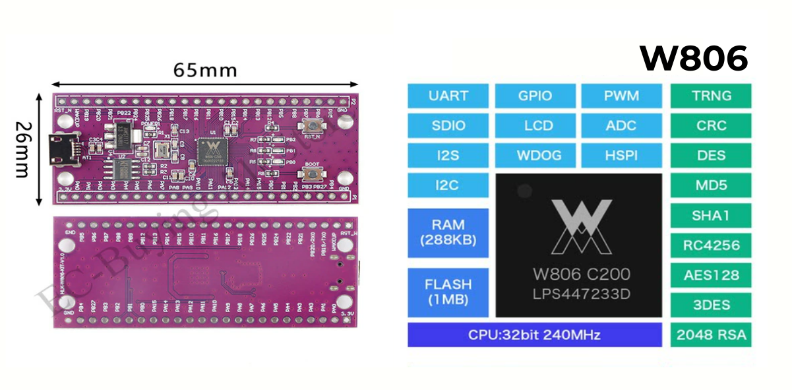
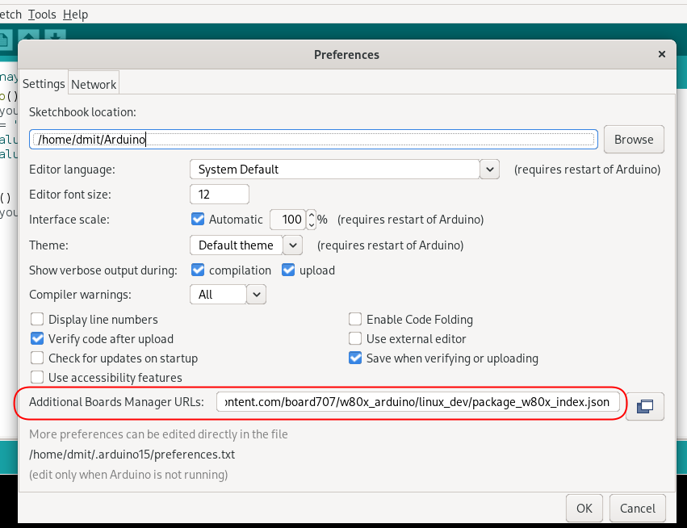
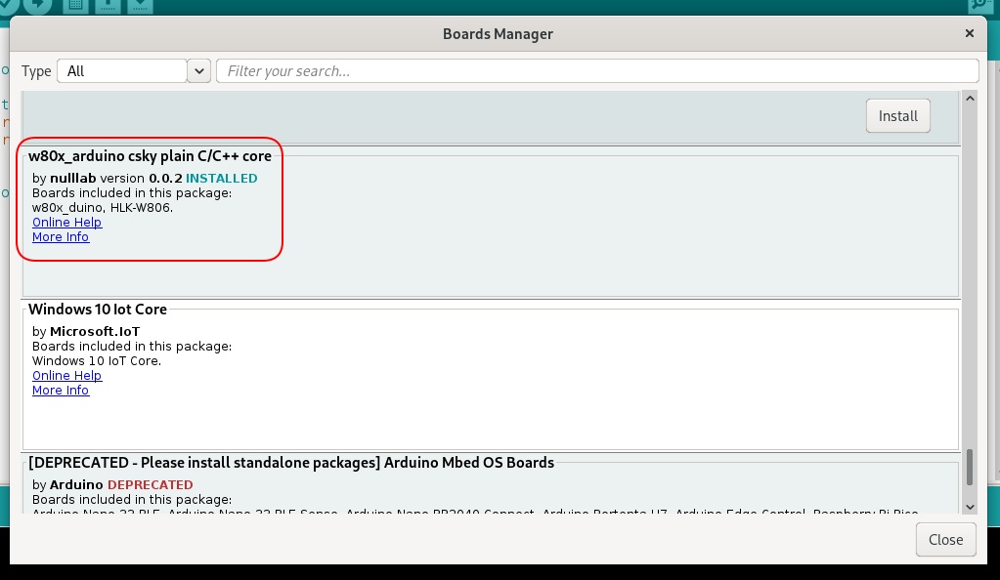
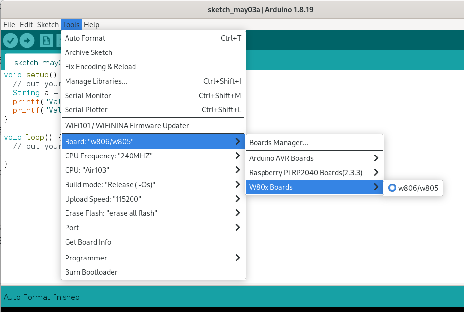

# w80x_duino
Arduino package for [WinnerMicro](http://www.winnermicro.com/) W806, Air103 and W801 boards, based on XT-E804 MCU

**W806 chip parameters**

- QFN56 package, 6mm x 6mm, pitch 0.35mm

**MCU Features**

- Integrated 32-bit XT804 processor, operating frequency 240MHz, built-in DSP, floating point unit and security engine
- Builtin 1MB Flash(2MB for W801)，288KB RAM
- Integrated PSRAM interface, supports up to 64MB external PSRAM memory
- 6x high-speed UARTs
- 4-port 16-bit ADC，max sample rate 1KHz
- 1 high-speed SPI（slave mode），up to 50MHz
- 1 SPI (master - slave mode)
- 1 SDIO_HOST，supports SDIO2.0、SDHC、MMC4.2
- 1 SDIO_DEVICE，supports SDIO2.0，up to 200Mbps
- 1 Hardware I2C 
- up to 44 GPIOs
- 5-channels PWM
- 1 Duplex I2S interface
- LCD interface，supports 4x32 device
- 1 7816 interface
- 15 Touch Sensor

**Power options**

- 3.3V single supply
- Sleep, standy and shutdown power modes
- Standby power consumption is less than 10uA

**Boards**

- [W806 pinout](doc/W806_pinout.png) 
- [W801 pinout](doc/W801_pinout.png) 
- [Air_103 pinout](doc/Air_103_pinout.png) 

## w80x_duino package installation in Arduino IDE

1. **File -> Preferences**

2. Enter the following URL in the additional development board manager URL:

> https://raw.githubusercontent.com/board707/w80x_arduino/hal-v0.6.0/package_w80x_index.json

3. **Tools -> Boards -> Boards Manager...**
Search for **w80x_duino**, select the latest version to install 

4. **Tools -> Boards**

## w80x_duino development
The ticked ones have been implemented and verified, the unticked ones are under development, and more developers are expected to maintain together

- [x] Arduino IDE package tools for Windows and Linux 
- [x] GPIO
- [x] [HardwareSerial](cores/w806/HardwareSerial.md) class
- [x] ADC
- [x] PWM
- [x] [HardwareTimer](libraries/HardwareTimer/Readme.md) lib
- [x] I2C - HardwareI2c, SoftwareI2c
- [x] SPI
- [x] [EEPROM](libraries/EEPROM/Readme.md) library
- [x] Stream, Print and String classes
- [ ] I2S interface
- [ ] SDIO interface
- [ ] DMA 

### Support
If you have any problems using the package, please submit an issue directly. Developers are welcome to collaborate and develop and submit commits. This project will continue to be updated.

## Credits
- Hi-Link developed and produced this development board
- This open source project is maintained on base of the nulllab team project [nulllab team](https://github.com/nulllaborg)

Original [README](README_ch.md) (chinesse)

